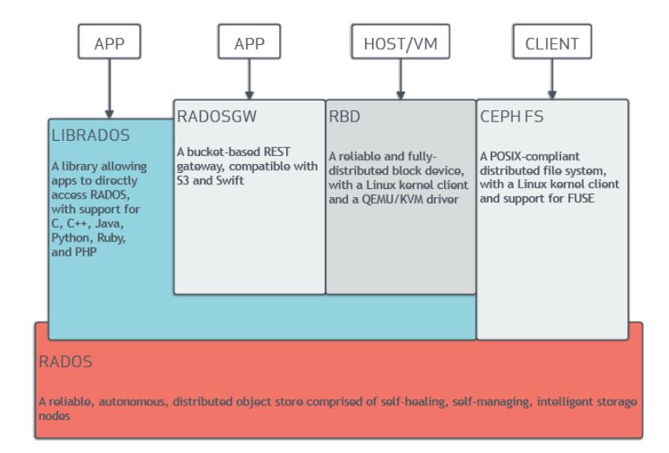
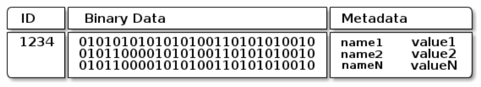
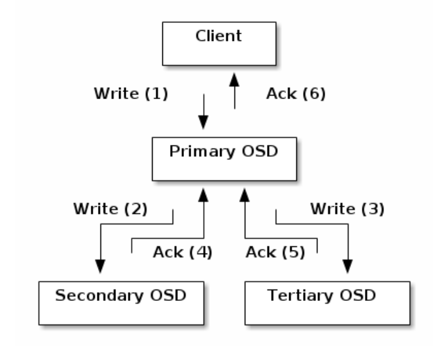

# Storage Tech Report -- Ceph

## prerequisite
对象储存(object storage)是区别于文件系统(file system)的储存方式，它将文件metadata，data，unique identifier绑定在一起。其中metadata是可定制的，区别于每种文件系统将metadata格式定死。而且目录储存方式是扁平结构（实际上为了scalability，GFS、Ceph、 openstack swift都使用了扁平的目录结构），区别于文件系统的树状结构。对象储存方式的存储量可以达到petabytes级别以上。因此对象储存的适用于大文件储存读取，分布式系统，并行化，文件元数据需要定制的情况。

RADOS (Reliable Autonomic Distributed Object Store) 是ceph服务端的储存系统，是分布式大型存储系统。
## 架构

### 客户端

Ceph 支持三种存储接口：对象存储 RGW(rados gateway)、块存储 RBD(rados block device) 和文件存储 CephFS;

值得区分的是ceph对于客户端虽然提供了三种储存方式的接口，但在服务端都是用对象储存的方式，而且服务端的对象储存与对客户端提供的对象储存并不相同。此处将服务端的对象储存称为内部对象储存。

#### 对象储存： LIBRADOS与RGW(RADOS Gateway)
对象储存的接口：
* LIBRADOS
    - 支持c,c++,java,python等语言的rados库，
    - 可以直接操纵ceph rados系统较为底层的API。
    - 这也就意味着许多优化需要客户端自己操纵，例如用户需要自己做文件分片，分片后储存物理机器的选择等。
* RGW
    - 基于librados
    - RESTful风格
    - 与Amazon S3 RESTful 接口兼容
    - 与OpenStack Swift接口兼容（Swift 只支持对象储存）
    - 高级API，无需用户进行文件分片等。

#### 块储存： RBD（RADOS block device）
- 基于librados
- 将block device storage_images存储为ceph内部对象。
- 保留块存储特性，主要面向云平台的虚拟机提供虚拟磁盘。
- 集成rados的scalability，并行等特点。

#### 文件系统 （CEPH FS）
* 支持POSIX
* 将文件系统数据（data）映射以内部对象储存的方式进行存储。基于librados。
* 为文件系统的元数据专门开启了元数据服务器（MDS），将目录与文件名映射到内部对象储存存储块。
* 此处的MDS与GFS很像，
只不过GFS将文件名以文件路径的方式储存在master中。master中根据所有文件metadata的知识进行优化。Ceph也做了类似的事情。
    - 平衡文件系统：可以将文件系统的储存平衡到各个物理结点。
    - 多备份
    - 由对象储存所带来的virtually unlimited storage

总之，由客户端可以看到Ceph支持多种存储方式，API丰富且兼容各大平台API。而带来的其他特性都是来自于服务端的内部对象存储。

### 服务端

服务端架构与GFS， K8s都有相似之处:
* 一个master掌握全局知识，对slave进行控制，将用户传来的请求分给多个slave。
* slave与client直接通信，完成client请求。
* master对整个过程监控，保证slave的availability， 多个slave之间， slave与master之间的consistence，对异常情况进行处理。
* master在闲暇时间对于slave任务分配进行rebalance。

具体而言Ceph中的master叫做monitor，slave叫做OSD（Object Storage Device）。除此之外的服务节点还有有MDS与Manager。MDS在客户端文件储存中提到过；Manager用于记录信息，为管理员提供dashboard。

#### 内部对象

Ceph的将客户端传来的数据转化为内部对象，内部对象由三部分组成
- ID：整个Ceph系统的唯一标识符，不局限于结点。
- Binary Data: 文件内容（data）
- Metadata： 键值对，customed
- 对象是数据存储的基本单元， 一般默认 4MB 大小。
- 对于大文件的存储，Ceph 提供的客户端接口会对大文件分片（条带化）后存储到服务端；这个条带化操作是在客户端接口程序完成的，在 Ceph 存储集群内存储的那些对象是没条带化的。客户端通过 librados 直接写入 Ceph 存储的数据不会分片。

#### 虚拟分区： pool与PG（placement group）
- 一个Ceph有多个pool， 一个pool有多个PG。
- pg_id = HASH(ID) % PG_num; 其中ID是内部对象的全局唯一标示符号， PG_num是一个pool中的PG个数。由此可以得到一个文件在一个pool中所属于的第几个PG。
- pg_id = pool_num + "." + pg_id; 将pool编号信息加入到pg中
- 到此pg代表了由ID确定的文件放在那个pool的哪个pg中。
- 此时pg代表了虚拟分区。

#### 虚拟分区 --> 物理分区： CRUSH算法
- 要将虚拟分区pg转换为物理分区，要用到CRUSH算法。
- OSDs = CRUSH(pg_id) ; OSDs代表了多个物理分区。
- 为什么不直接用 OSD = HASH(PG_ID) % OSD_num; OSD_num 代表OSD的个数。
    * OSD守护进程是很可能挂掉的，因此一旦OSD挂了，OSD_num改变，整个虚拟分区向物理分区的映射将会改变。
    * 但是pg_id = HASH(ID) % PG_num; 式子中PG_num是预先定好的值，不会轻易改变，因此可以用这种结构。与此同时，也提醒我们不要在生产环境轻易改变PG_num的值
    * 利用CRUSH算出的OSDs实际上是一个List，有多个OSD，这符合数据冗余的要求，例如三备份，CRUSH会返回三个OSD，一个primary，两个secondary。而HASH只能返回一个。

#### 物理分区： OSD，client通信。client读写OSD。
以三备份为例，确定物理分区后,用户直接与OSD通信。

## 总结
pros
* ceph架构仍是master-slave架构，用户直接与slave通信减少master压力，因此master（hopefully）不会成为瓶颈。同时master拥有全局知识，可以选取最优解，达到存储分布最优。
* 利用对象储存的方式达到high scalability， virtually unlimited storage， large storage， parallel read/write。
* 利用CRUSH算法达到数据均匀的分布，实现OSD合理集群。
* 利用多个Monitor做到high availability。
* 提供多种储存服务。

cons
* 仍是master-slave架构。当slave机器数量达到一定级别时，master仍有可能成为瓶颈。
* Ceph 最初的目标是做一个分布式文件系统，直到现在这个目标也不能算完美实现；目前官网上对它的文件系统还是谨慎推荐的态度（不建议对线上核心业务部署）。

## reference
* https://www.cnblogs.com/me115/p/6366374.html 《玩转 Ceph 的正确姿势》。
* https://mp.weixin.qq.com/s/Q6aWSIuOJOaC9m1ZTOR_Zg? 《大话Ceph--CRUSH那点事儿》。
* https://docs.ceph.com ceph官网。

