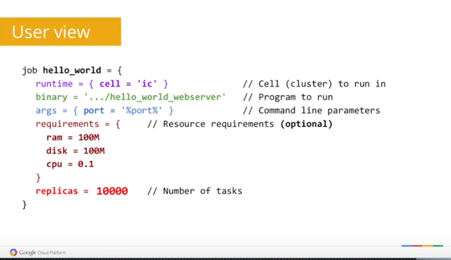
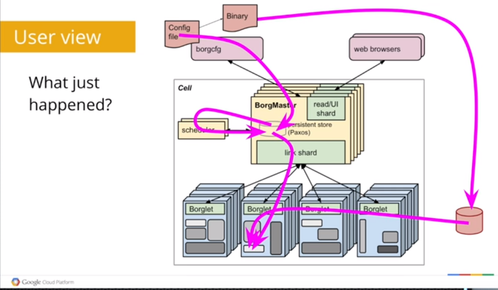
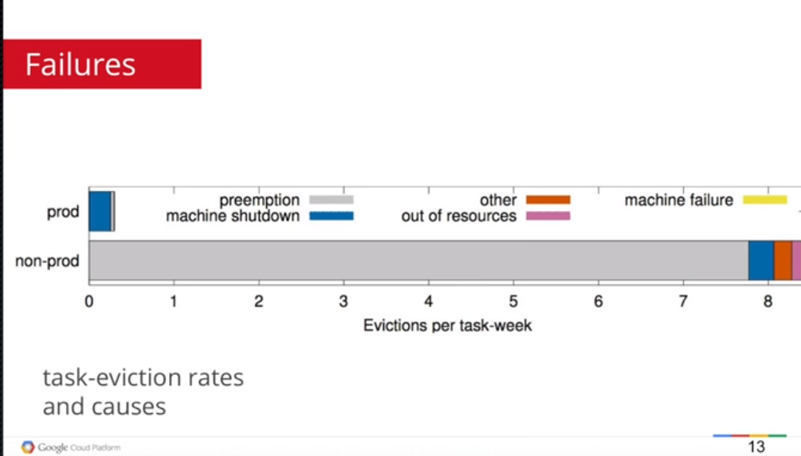
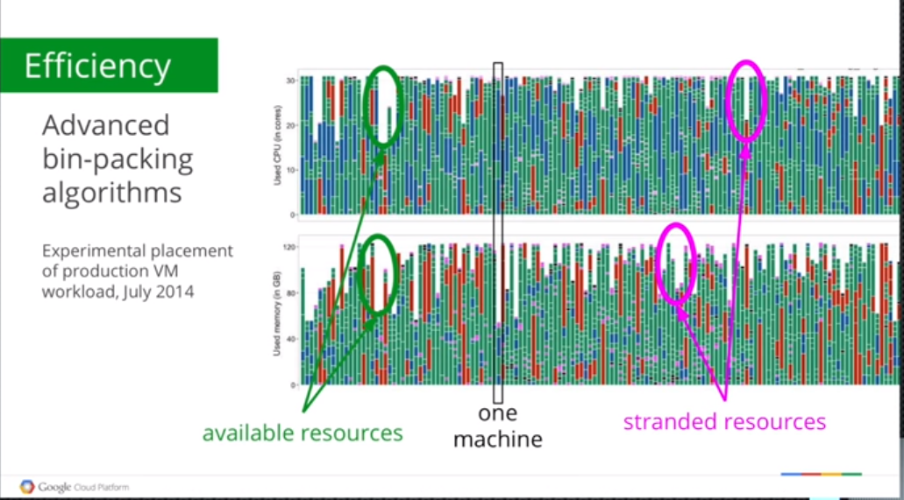
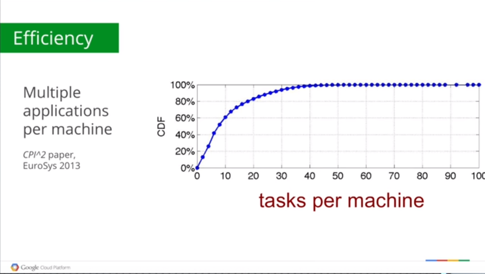
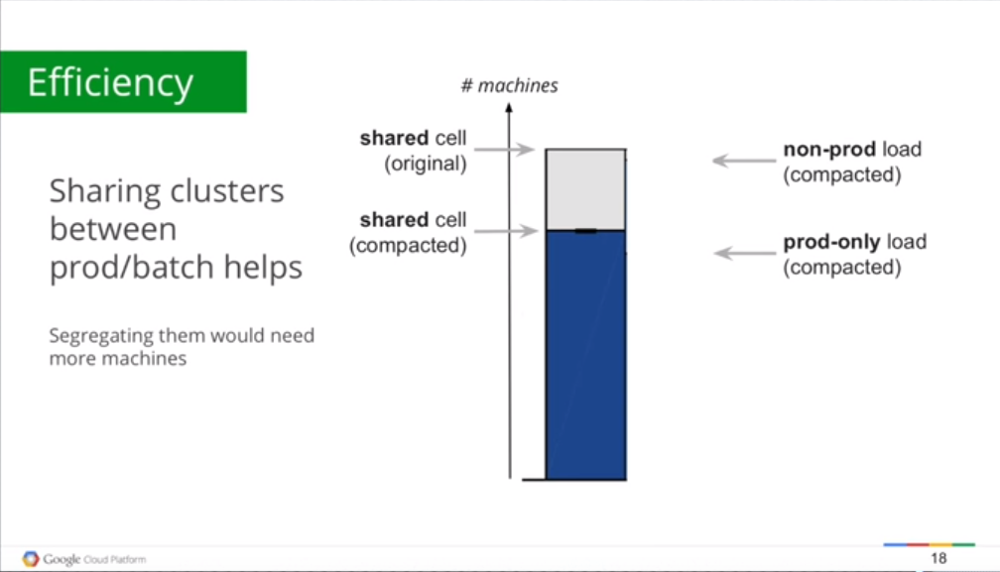
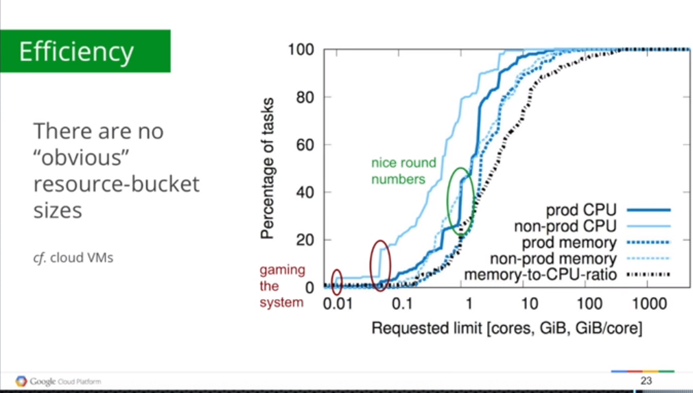
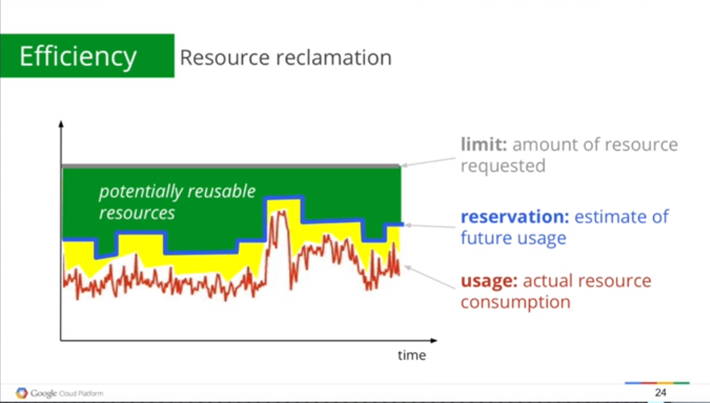
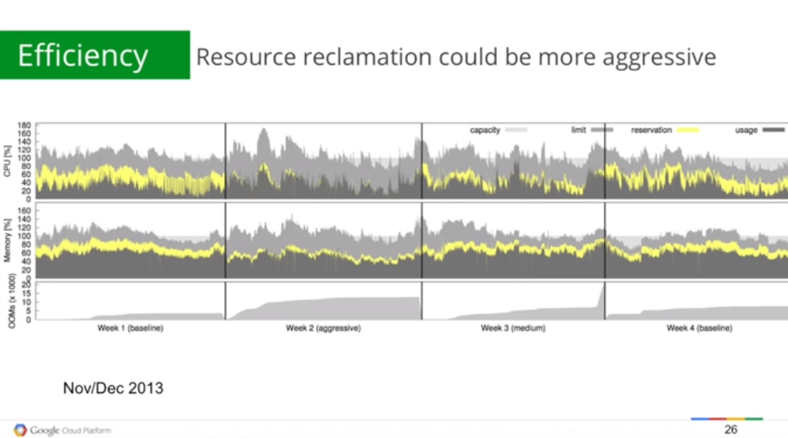

# Large-scale cluster management at Google with Borg

## limitation

- Insufficient IPv4 addresses(need to perform internal mapping)
- Network bandwith
- Unsastifiable processing power
- Huge user base with high consistency, reliablity and response time demand
- High number of applicatons
- Different configurations for each process and there are crazily lots of them
- Insufficient fast storage(memories, caches)
- Not enough menpower(SRE) to manage these machines. Need automatic clusters management to save cost and menpower
- Unacceptable fault-recovery time
- Inefficient scheduling policies of previous proposed systems

## Borg's Benefit

- Hides the details ofresourcemanagementandfailurehandlingsoitsuserscan focus on application development instead.
- Operates with very high reliability and availability, and supports applications that do the same.
- Let users run workloads across tens of thousands of machines effectively. 

## User's perspective

Borg’s users are Google developers and system administrators (site reliability engineers or SREs) that run Google’s applications and services. They submit tasks through a layer of abstraction to borg:  
  

Tasks are submitted to internal servers and Borgmaster to coordinate them in a number of different machines:
  

- A 2 way submition can confirm task consistency  
- 4 Borglets are responsible to 1 Borgmasteras shown because when failure occurs there are backups. This can ensure reliability.  
- Link shard is first step of scheduling to share jobs and pooling accross Borglets

## Failures

## Efficiency

To reduce failures overhead, Google tend to use VMs to save configurations for different workload. This creates a new problem of low efficiency  

  

To solve this, Google use a more optimized container technology to run their different services in Borg(as well as Kubernetes which is the extension of Borg in later days)

  

Before Borg, Google has problem with their efficiency in the clusters and they tend to solve them by buying new machines with more cores(and lots of them) later on, they scale it by improving the efficiency through scheduling algorithm for these workload. Unfortunately it is still not enough. That's where Borg comes in.

  

## Borg new approach to scheduling

Below shows the task number and probability of tasks running on different number of cores:  

  

Turn out Borg can schedule the resources of these machines through predictions as shown:

  

Borg packages the workload on different machines through reservation techniques: If you need it, it's there, if you don't, we will pack jobs into production machines we run workload in. Of course there are safety margin for it as shown:  

  

## Borg Lite(Kubernetes)

With Borg, users can focus on their application in their container. All those things are just there. There are other people looking after them. This makes Google developers extremely productive. Containers are also much more efficient then VMs that need so many user-defined configurations and it's crazy.  

Docker is the first version of this and ran on Borg initially  

And then Borg lite appears. It is renamed to **Kubernetes** now.

## Allocation

Priority expresses relative importance for jobs that are running or waiting to run in a cell. Quota is used to decide which jobs to admit for scheduling. Quota is expressed as a vector of resource quantities (CPU, RAM, disk, etc.) at a given priority, for a period of time (typically months). The quantities specify the maximum amount of resources that a user’s job requests can ask for at a time. Quota-checking is part of admission control, not scheduling: jobs with insufficient quota are immediately rejected upon submission. 

Higher-priority quota costs more than quota at lowerpriority. Production-priority quota is limited to the actual resources available in the cell, so that a user who submits a production-priority job that fits in their quota can expect it to run, modulo fragmentation and constraints. 

Unfortunety, Borg doesn't implement front-end load balancing. This is later refined in Kubernetes  

## Reference  
- https://ai.google/research/pubs/pub43438
- https://www.youtube.com/watch?v=0W49z8hVn0k&t=276s

Meng Yit Koh  