# Omega

## 背景
* 数据中心建立在硬件构成的集群
* 集群中需要运行各种各样的应用
* 每种应用都需要不同的框架
* 过去一个集群只能有一个框架
* 现在希望一个集群可以兼容多个框架，
* 从而提高资源利用率，降低成本
* 而且这个集群可以scale
* 还可以HA

## 解决办法
### statical partition
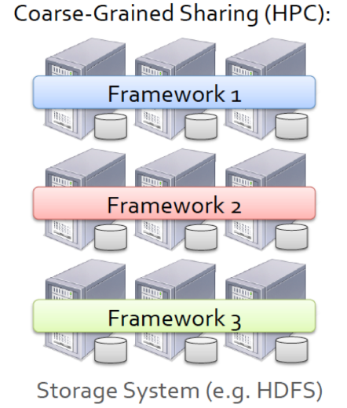
* 将一个集群静态划分为多个partition
* 不同的partition运行不同的框架
* HPC利用了这种模式
* 这种模式是粗粒度的共享集群（Coarse-Grained Sharing）与后文的Mesos的细粒度（Fine-Grained sharing）相对应。
* Coarse-Grained Sharing指将job分类，对于不同的job分到不同的partition
* 问题
    - 资源利用率还是低
    - 应用的资源分布在实时变化，将资源的分布预先写死肯定不好。
    - 就算对于不太变化的框架如Hadoop，有可能partition的分配从一开始就不合理。

### 2-layer sharing
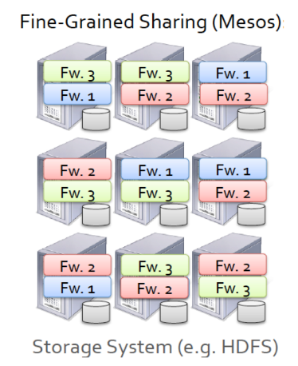
* 一个物理结点可以运行多个框架
* 创新点
  - 细粒度（Fine-Grained sharing）： 对于一个job的每个tasks都进行分配。
  - resource offering：将可用的资源提供给框架，让框架自己选择资源。
    * 简单，简单代表了更好的scale
    * 由于集群有多个框架，让一个框架自己选择实际上，只有局部信息，因此无法得到最优解。omega改善了该问题。
    * 消极冲突解决（pessimistic concurrency control）：如果多个框架请求资源，那么master节点每次只将资源分配给一个框架，也就是说，其中一个框架拿锁，另一个框架等待。omega改善了该问题。 
* Mesos使用了这种模式
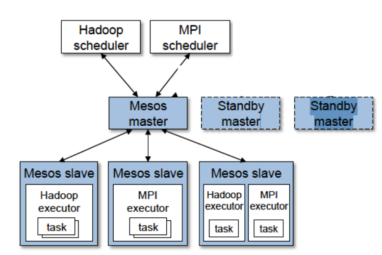
    - mesos slave结点有多个框架
    - 每个框架运行job中的某个task，而不是job
    - standby master提高HA
    - resource offering如下图
    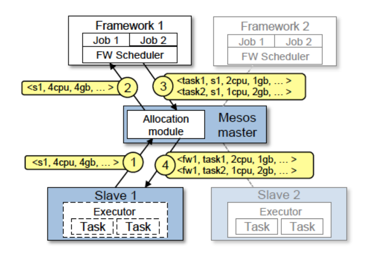
        1. slave结点告知master可用的cpu，内存
        2. master将部分可用信息告知框架1
        3 框架1自己将tasks分配给对应的结点，并且确定每个tasks分配的cpu、内存等信息。然后将信息送给master
        4. master将信息传给slave，slave执行相应的资源分配。

## omega
google提出了Omega，着重与mesos代表的2 level架构进行了对比，体现了Omega的优化。

### mesos problem revise
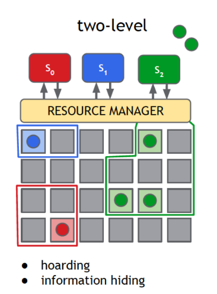

上文已经提到了mesos的两大问题。
* mesos给框架提供的是局部信息，得不到最优解
* mesos处理并发用的是消极模式

### omega proposal
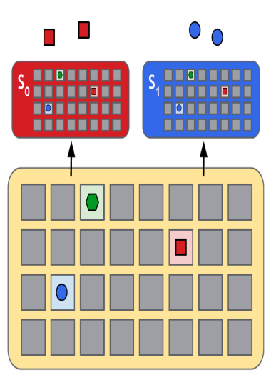

omega为了解决问题提出了以下设计。
* cell state： 每个框架拿到的信息都是从master结点复制的信息，也就是说，框架可以拿到全局信息，进而框架可以计算出最优解。
* parrallel schedule
    - 多个framework并行做了决定，更新了自己的cell state。
    - 这些framework用自己的cell state更新master的cell state。
    - 如果有冲突，则让某个框架分配资源失败。
    - 更新所有框架全部的cell state。
    - **comment**： 我理解的share state类似于最基础git workflow。master相当于远端服务器。每个框架相当于本地机器。每个本地机器都从服务器copy一份相同的内容，然后并行的更新内容。如果有冲突，就做额外的操作修复。

到此用上述两种方法解决了mesos的两个问题。

### Google workload
在omega这篇论文中，大量篇幅阐释了google workload。
- google的jobs大部分是batch job， 但是耗资源还是service厉害。
- batch jobs 80%ile的runtime是12-20min
- service jibs 80%ile的runtime是29天
- batch jobs 80%ile的inter-arrival time是4-7s
- service jobs 80%ile的
inter-arrival time是2-15min

### experiment
利用上述workload，google做了以下实验。

* experiment 1： shared-state与其他架构的对比
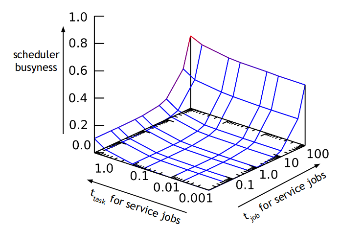
     - 红色代表仍有未被调度的jobs
     - 蓝色代表全部的jobs都被调度
     - scheduler busyness = 用于调度的时间/总时间
     - t_{job} = 一个job的带来的overhead
     - t_{task} = 分配每个task需要的时间
     - 由于一个job有许多task，所以调度器一次决策的时间 t_{decision}=t_{job} + numOfTasks * t_{task} 
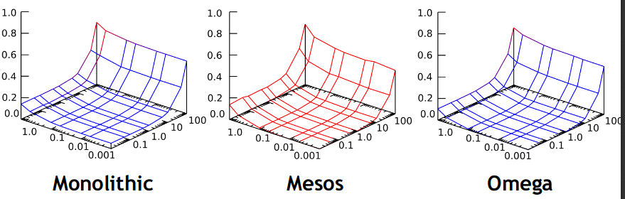
     - 结论： "The Omega shared-state model performs as well as a (complex) monolithic multi-path scheduler".
     - 顺便讨论了为什么mesos在这种情况下效果为什么这么差。（这里我没有读懂）
        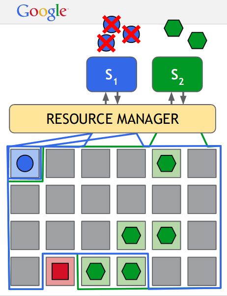
        * 绿色正在分配资源
        * 绿色框架拿锁
        * 蓝色的收到了小的分配请求，却无法分配
        * 多次重复
        * 绿色完成了调度，释放锁
        * 蓝色收到的大的分配请求
        * 小的分配请求都放弃了。

* experiment 2： shared-state design是否能scale到许多的调度器？得到的结论是：随着job arrival rate越来越高，调度器busyness也升高；但当调度器从1单位拓展到32时，调度器升高的幅度明显降低。这说明shared state能很好的拓展到许多调度器。

* experiment 3： 如果用Google真实的workloads会对Omega带来多少干扰。
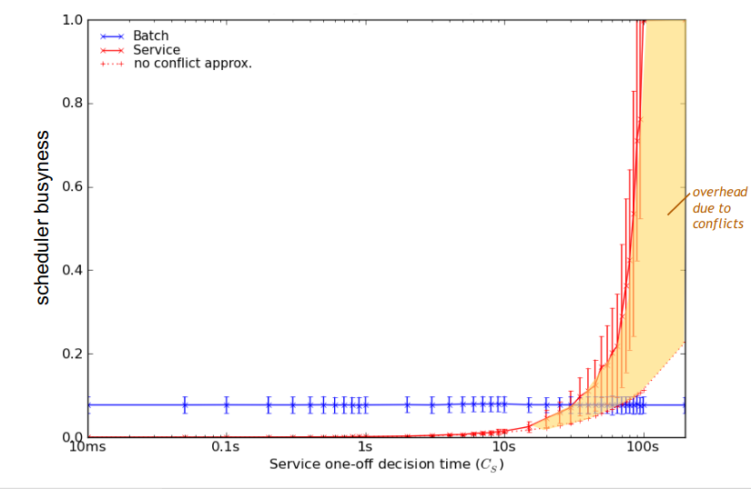
    - service one-off decision time就是上文提到的t_decision, 如果一个job中的task相当多，那么一次decision达到100s也是可能的。
    - scheduler busyness与上文相同

说明实际Google workload下因为conflict所带来的overhead变得非常之高。

* experiment 4:
既然有上述问题，那可以调优吗？
    - Coarse-Grained conflict detection：只要检测到master上面的state有更新，那么代表framework上的更新落后了，通通扔掉。
    - Fine-Grained conflict detection：监测如果更新了是否会有某个结点overcommit。
    - Coarse & Fine： course简单，只需要sequence number监测是否状态落后； Fine性能更好。
    - Gang commits： 冲突解决单位是job，一旦两个framework的job发生冲突，不管job中有些task是不冲突的，也通通fail。
    - Increment commits： 
    冲突解决单位是task，一旦两个framework的task发生冲突，只放弃冲突的task
    - gang & incr： gang 适用于一个job需要依赖于其他所有tasks跑起来；incr性能更好，而且可以防止starvation。
    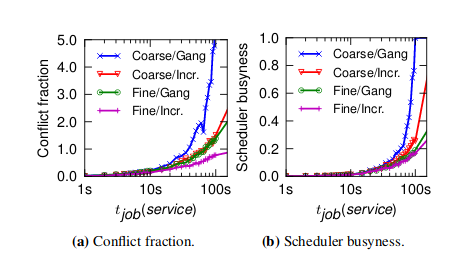

当调整到Fine/incr时，性能有了极大提升。

## conclusion
Omega is
- Flexibility and scale require parallelism
- parallel scheduling works if you do it right 
- using shared state is the way to do it right

但是
- omega是google的论文框架，貌似没有投入到生产领域，没有borg在生产环境中的检验。
- omega的evaluation仅仅看了google的workload，不一定使用于其他公司的workload。
- 尽管omega论文在对比时，第一个讲的就是单体设计的坏话，但是k8s、borg还是强。

