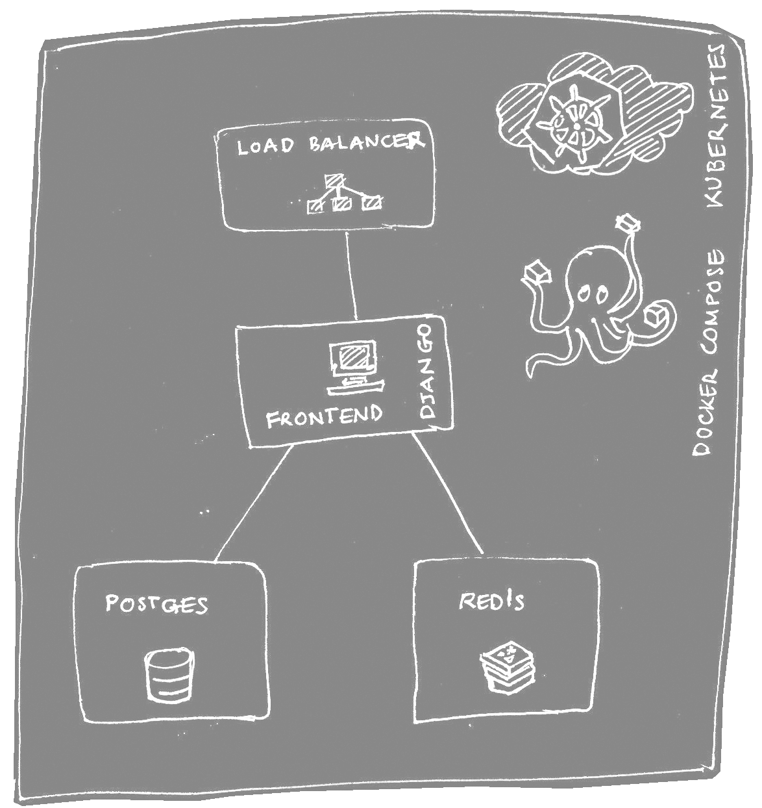
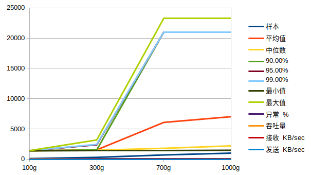
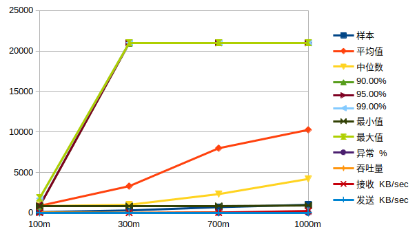

# Tiny-URL application

## Source Code

Due to the usage of Jenkins and Github webhook, we have created a new github repo [here](https://github.com/kmykoh97/tinyurl-kubernetes)

## Introduction

Implement simple TinyURL application frontend and backend and deployment on AWS using Docker and Kubernetes

## Technology stack

- Python & Django Framework (frontend, backend)
- Redis (Read Cache)
- Postgrad & MongoDB (Sql and NoSql databases)
- Docker (Deployment container)
- Minikube (Kubernetes)
- Jenkins (CI/CD)
- Jmeter (Performance test)

## Feature  

- Fast read due to Redis cache
- Automatic CI/CD kubernetes redeployment on github push
- Kubernetes dashboard  
- Autoscaling
- Load Balancing
- Automatic redeployment upon crash
- Performance friendly backend
- accessible by http protocol

## Framework

## Performance

## Special Thanks

Ren Rui from School of Software Engineering, Shanghai Jiao Tong University  